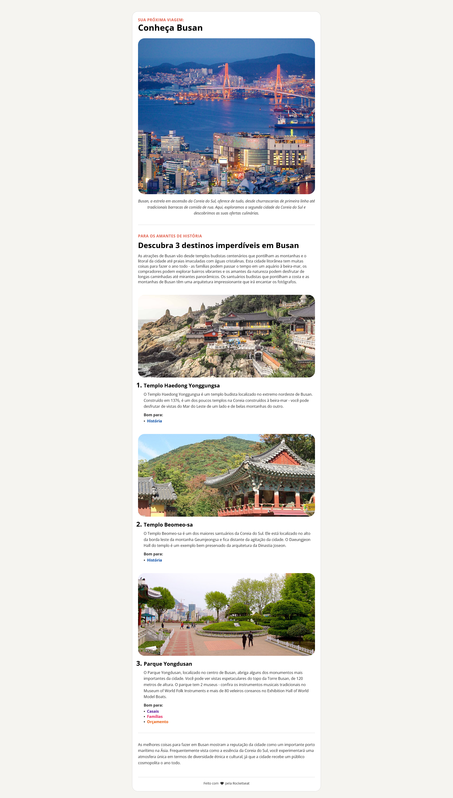

# Local Turístico

Layout de uma página sobre um local turístico, desenvolvido durante o curso Full Stack da Rocketseat, com foco em HTML semântico e CSS.



## 🔗 Demo

[higorgsantana.github.io/Local-turistico](https://higorgsantana.github.io/Local-turistico/)

## 🛠️ Tecnologias

- HTML5
- CSS3

## 💡 Sobre

Projeto criado para praticar estruturação semântica de páginas e estilização com CSS puro, como parte dos estudos da trilha Full Stack da Rocketseat. Foi um dos primeiros projetos da trilha, com foco em fundamentos de HTML e CSS, incluindo a propriedade `box-sizing: border-box` para controle mais preciso de dimensões dos elementos.

## ⚙️ Como rodar

Clone o repositório e abra o arquivo `index.html` diretamente no navegador:

```bash
git clone https://github.com/higorgsantana/Local-turistico.git
```

Ou acesse a versão publicada direto pela demo acima.
